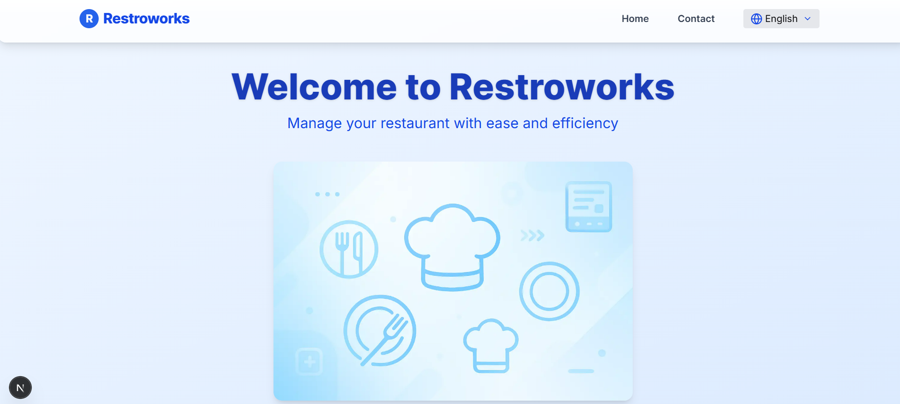
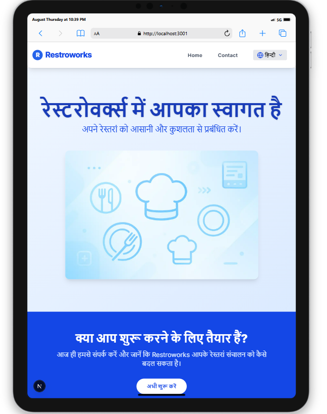
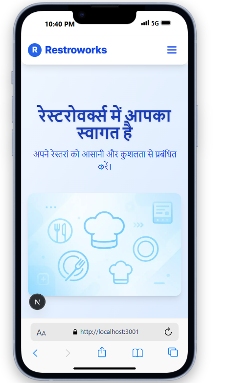
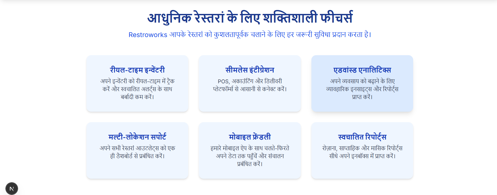
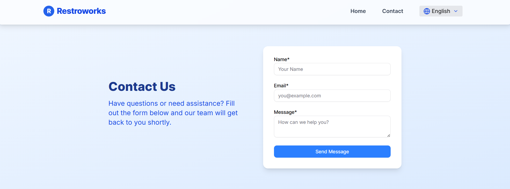
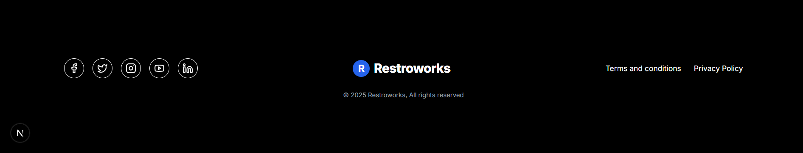

# Restroworks Frontend

This is the **Next.js frontend** for the Restroworks project, a modern restaurant management SaaS platform.  
It supports localization (English/Hindi), dynamic content from PayloadCMS, SEO best practices, and more.

## 🖥️ Technology Stack

| Category         | Packages / Tools Used                                                                 |
|------------------|--------------------------------------------------------------------------------------|
| **Framework**        | Next.js (v15+), React (v19+), TypeScript                                      |
| **UI/Styling**       | Tailwind CSS, shadcn/ui, lucide-react
| **Forms/Validation** | Formik, Yup                                                                   |
| **Utilities**        | axios, react-toastify, motion, clsx, class-variance-authority, tailwind-merge  |
| **Env/Build**        | env-cmd, next-sitemap                                                         |
| **Backend**          | PayloadCMS (local), MongoDB                                                   |

---


---

## 🚀 Features

- **Next.js App Router** (v15+)
- **Localization (i18n)**: English (`en`), Hindi (`hi`)
- **Dynamic Content**: Fetches pages and blocks from PayloadCMS backend
- **SEO Optimized**: Dynamic metadata, sitemap, robots.txt
- **Custom 404, Loading, and Error pages**
- **Contact Form**: Integrated with backend API using Formik for form state management and Yup for validation.
- **Image Optimization**: Uses Next.js `<Image />`
- **Tailwind CSS** for styling
- **shadcn/ui** for modern, accessible UI components

---


## 🏗️ Project Structure

```
frontend/
├── .next/                  # Next.js build output (auto-generated)
├── node_modules/           # Node.js dependencies
├── public/                 # Static assets (images, favicon, etc.)
├── src/
│   ├── app/
│   │   ├── [locale]/       # Locale-based routing (en, hi, etc.)
│   │   │   ├── contact/    # Contact page (localized)
│   │   │   ├── lang/       # Language local static file
│   │   │   ├── error.tsx   # Custom error page
│   │   │   ├── layout.tsx  # Layout for locale pages
│   │   │   ├── loading.tsx # Loading state for locale pages
│   │   │   └── page.tsx    # Home page (localized)
│   │   ├── favicon.ico
│   │   ├── global-not-found.tsx # Global 404 page
│   │   └── globals.css     # Global styles (Tailwind, etc.)
│   ├── components/         # Shared shadcn ui components
│   ├── lib/                # Library code and helpers
│   ├── utils/              # Utility functions
│   └── views/              # UI blocks and view components
│       └── middleware.ts   # Middleware for Next.js (e.g., i18n)
├── .env                    # Environment variables
├── .env.dev
├── .env.local
├── .gitignore
├── components.json         # shadcn/ui config
├── eslint.config.mjs       # ESLint configuration
└── README.md               # Project documentation
```

---

## 🛠️ Getting Started


1. **Clone the repository:**
   ```sh
   git clone https://github.com/sgovind158/restroworks.git
   cd restroworks/frontend
   ```

2. **Install dependencies:**
   ```sh
   npm install
   ```

3. **Set up environment variables:**
   ⚠️ **Note:** Normally, we do **not** commit `.env` files to version control for security reasons. 
   For your convenience and easy installation, `.env`, `.env.dev`, and `.env.local` files are included in the repository. 

3. **Run the development server:**
   ```sh
   npm run dev
   ```

4. **Build for production:**
   ```sh
   npm run build
   npm start
   ```

---

## 🌐 Localization

- All pages are available in English (`en`) and Hindi (`hi`).
- Locale is determined by the URL (e.g., `/en`, `/hi`).

---

## 📸 Screenshots












## 📝 Notes

- Content is managed via [PayloadCMS](https://payloadcms.com/).
- Uses [shadcn/ui](https://ui.shadcn.com/) for UI components.

---

## 📂 Related

- [Restroworks Backend (PayloadCMS)](../backend)
- [PayloadCMS Documentation](https://payloadcms.com/docs)

---


## 📄 License

MIT